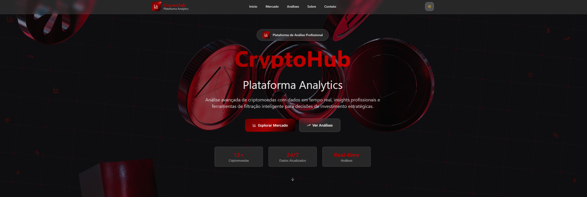

# 📊 Crypto Glass Hub - Visão Transparente do Mercado!
<p align="center">
  
  
  
</p>

<div align="center">
  
</div>

## 📋 Sobre o Projeto
O **Crypto Glass Hub** é uma plataforma web interativa que oferece uma leitura clara, moderna e visual do universo dos criptoativos. O projeto foi construído com tecnologias de ponta como **React**, **TypeScript** e **Shadcn UI**, com foco em **experiência fluida**, **design responsivo** e **informações de valor real** para usuários que desejam acompanhar o mercado cripto com precisão e estilo.

## ⚙️ Funcionalidades Principais
* **Dashboard Dinâmico**: Visualização clara das principais criptomoedas do mercado.
* **Análise Individual**: Páginas dedicadas com informações detalhadas por ativo.
* **Sistema de Filtros e Busca**: Permite refinar dados rapidamente.
* **Tema Claro/Escuro**: Alternância de temas com base na preferência do usuário.
* **Design Responsivo**: Adaptação para dispositivos móveis, tablets e desktops.

## 🌐 Visualize o Projeto
Acesse a aplicação diretamente pelo link:
👉 [**Crypto Glass Hub**](https://devandreotti.github.io/crypto-glass-hub/)

## 🛠 Tecnologias Utilizadas
* **[React](https://react.dev/)** — Framework JavaScript para UIs declarativas e componentizadas.
* **[TypeScript](https://www.typescriptlang.org/)** — Tipagem estática para maior robustez no desenvolvimento.
* **[Vite](https://vitejs.dev/)** — Ferramenta de build extremamente rápida e moderna.
* **[Tailwind CSS](https://tailwindcss.com/)** — Estilização com classes utilitárias altamente responsivas.
* **[Shadcn UI](https://ui.shadcn.com/)** — Coleção de componentes acessíveis, reutilizáveis e prontos para produção.
* **[React Router DOM](https://reactrouter.com/en/main/start/tutorial)** — Roteamento declarativo e dinâmico no frontend.
* **[TanStack Query (React Query)](https://tanstack.com/query/latest)** — Gerenciamento de estado assíncrono e cache de dados.
* **[Spline](https://spline.design/)** — Ferramenta para criação e incorporação de elementos 3D interativos.
* **[Lucide React](https://lucide.dev/guide/packages/lucide-react)** — Ícones SVG personalizáveis e modernos.
* **[Zod](https://zod.dev/)** — Validação de esquemas com TypeScript-first.
* **[React Hook Form](https://react-hook-form.com/)** — Biblioteca para gerenciamento de formulários de forma eficiente e performática.

## 📂 Estrutura do Projeto
```
crypto-glass-hub/
├── public/
│   ├── favicon.ico
│   ├── placeholder.svg
│   └── robots.txt
└── src/
    ├── App.tsx
    ├── main.tsx
    ├── index.css
    ├── App.css
    ├── vite-env.d.ts
    ├── components/
    │   ├── Hero.tsx
    │   ├── Navbar.tsx
    │   ├── Footer.tsx
    │   ├── MarketSection.tsx
    │   ├── CryptoCard.tsx
    │   ├── CryptoFilters.tsx
    │   └── ui/           ← Componentes reutilizáveis (Shadcn)
    ├── hooks/
    │   ├── useCryptoData.tsx
    │   ├── useCryptoFilters.tsx
    │   ├── use-mobile.tsx
    │   └── useTheme.tsx
    ├── lib/
    │   └── utils.ts
    └── pages/
        ├── Index.tsx
        └── NotFound.tsx
```

## 🚀 Como Rodar Localmente
1. **Clone o repositório:**

   ```bash
   git clone https://github.com/devAndreotti/crypto-glass-hub.git
   ```
2. **Acesse a pasta do projeto:**

   ```bash
   cd crypto-glass-hub
   ```
3. **Instale as dependências:**

   ```bash
   npm install
   # ou yarn
   # ou bun
   ```
4. **Execute o servidor de desenvolvimento:**

   ```bash
   npm run dev
   # ou yarn dev
   # ou bun dev
   ```

## 🔮 Futuras Melhorias
* [ ] **API em Tempo Real**: Conectar com fontes atualizadas de dados cripto.
* [ ] **Sistema de Login e Perfis**: Para funcionalidades personalizadas.
* [ ] **Alertas Customizáveis**: Notificações de preço, volume e movimentações.
* [ ] **Gráficos Avançados**: Para análise técnica e visualização de tendências.
* [ ] **Otimizações de Performance**: Redução de tempo de carregamento.
* [ ] **Testes Automatizados**: Cobertura com testes unitários e de integração.

## 💪 Como Contribuir
Contribuições são bem-vindas!
Siga os passos abaixo para contribuir:

1. Faça um fork do repositório.
2. Crie uma branch: `git checkout -b feature/sua-feature`.
3. Commit suas alterações: `git commit -m "feat: minha contribuição"`.
4. Faça o push da branch: `git push origin feature/sua-feature`.
5. Abra um Pull Request com um resumo das alterações propostas.

## 📝 Licença
Este projeto está sob a licença MIT.
Consulte o arquivo [LICENSE](https://github.com/devAndreotti/devAndreotti/blob/main/LICENSE) para mais detalhes.

<br>

---

<p align="center">
  Desenvolvido com ☕ por <a href="https://github.com/devAndreotti">Ricardo Andreotti Gonçalves</a> 🧑‍💻